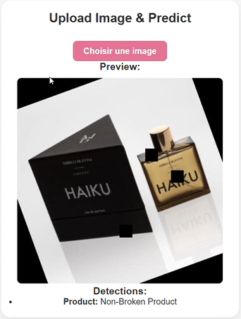
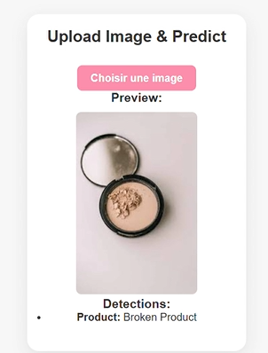
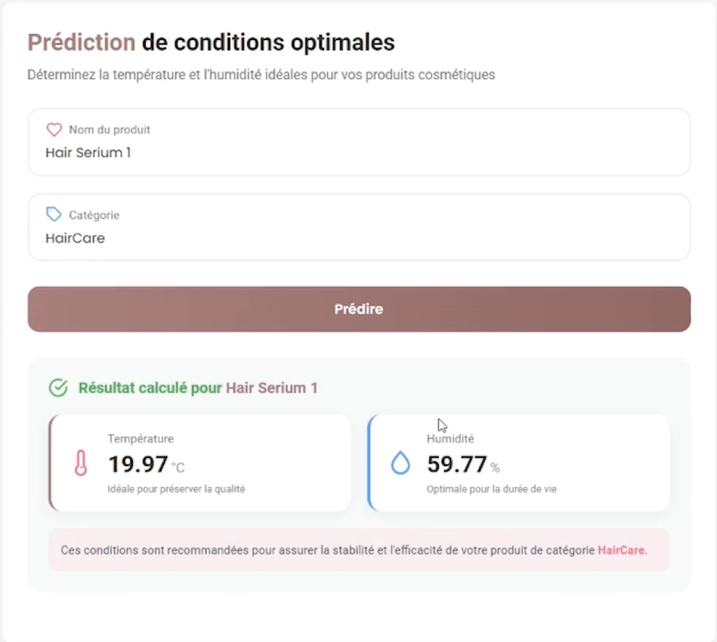

# 💄 Beauty Flow — Optimisation de la Supply Chain Cosmétique

Ce dépôt GitHub regroupe toutes les phases du projet **"Beauty Flow"**, dont l’objectif est d’optimiser la chaîne d’approvisionnement dans le domaine des cosmétiques en s’appuyant sur des algorithmes de Machine Learning et Deep Learning.

---

## 🗂️ Structure du projet
Deploiment-ML/
├── data/ # Données brutes pour l’ETL et l'entraînement
├── models/ # Modèles entraînés (.pkl, .pt, .h5, .pth...)
├── notebooks/ # Notebooks Jupyter pour exploration et entraînement
├── src/ # Code source (prétraitement, entraînement, évaluation…)
├── requirements.txt # Fichier des dépendances Python
├── app.py # Script principal pour lancer l'application
├── README.md # Documentation du projet

---

## 📦 Données

Le dossier `data/` contient l’ensemble des fichiers de données nécessaires pour entraîner les modèles et construire les processus ETL.

### 🧾 Description des fichiers

| Fichier                              | Description                                                                 |
|-------------------------------------|-----------------------------------------------------------------------------|
| `base_materials_with_units.csv`     | Liste des matières premières utilisées                                     |
| `cosmetic_products_base_materials.json` | Composition des produits cosmétiques à partir des matières premières       |
| `factures_produits.pdf`             | Factures de vente des produits aux magasins                                |
| `orders_products_2022_2024.json`    | Historique des commandes des produits entre 2022 et 2024                   |
| `production_data.xlsx`              | Données sur les temps et capacités de production                           |
| `supplyChain.bak`                   | Sauvegarde de la base de données (fournisseurs, adresses, etc.)           |

---

## 🤖 Modèles Enregistrés

Le dossier `models/` contient les modèles entraînés et prêts à être utilisés dans l'application.

| Fichier                        | Description                                                                 |
|-------------------------------|-----------------------------------------------------------------------------|
| `model_temperature_humidity.pkl` | Modèle de prédiction de température/humidité idéale pour le stockage      |
| `best.pt`                     | Modèle YOLOv8 pour détecter et classifier les produits cosmétiques          |
| `trained_model_cpu.pth`       | Modèle PyTorch recommandant un produit selon la couleur de peau             |
| `my_model.pt`                 | Modèle utilisant OpenCV pour vérifier si un produit est cassé (réclamation) |
| `rf_model.pkl`                | Modèle utilisant une régression linéaire pour prévoir les revenus des magasins |
| `regression_model.pkl`        | Modèle pour prédire les changements dans les matières premières             |

🖼️ Tester le modèle pour les produits cassés et non cassés :
- Produit non cassé : 
- Produit cassé : 

🖼️ Tester l'environnement optimal pour stocker les produits : 

---

## 📒 Notebooks d’Expérimentation

Tous les notebooks Jupyter utilisés pour l’expérimentation sont disponibles dans le dossier `notebooks/`.

### 🔬 Deep Learning

| Notebook                              | Description                                                                 |
|--------------------------------------|-----------------------------------------------------------------------------|
| `Broken-non Product.ipynb`           | Détection de produit cassé (YOLOv11)                                        |
| `Product_prediction.ipynb`           | Prédiction du type de produit (YOLOv8)                                      |
| `skin_prod_shade_checkpoint.ipynb`   | Recommandation produit selon la teinte de peau (PyTorch)                    |

### 🧠 Machine Learning

| Notebook                              | Description                                                                 |
|--------------------------------------|-----------------------------------------------------------------------------|
| `model_temperature_humidity.ipynb`   | Prédiction des conditions optimales de stockage avec XGBoost               |
| `amazone_web_scraping_beautufifull_soup.ipynb` | Scraping de produits pour collecter des données externes avec BeautifulSoup |
| `ShopAmount (1).ipynb`               | Prédiction des bénéfices des boutiques sur une période donnée              |
| `Décideur1 (1).ipynb`                | Modèle pour prévoir les changements de prix des matières premières          |

---

## ⚙️ Installation

1. Cloner le dépôt :
```bash
git clone https://github.com/rayan70/Deploiment-ML.git
cd Deploiment-ML
```

2. Installer les dépendances :
```bash
pip install -r requirements.txt
```

## 🚀 Utilisation

1. Lancer l'application :
```bash
python app.py
```

2. Faire une requête POST à l'API `/predict` avec des données JSON :
```json
{
    "features": [valeur1, valeur2, ...]
}
```


